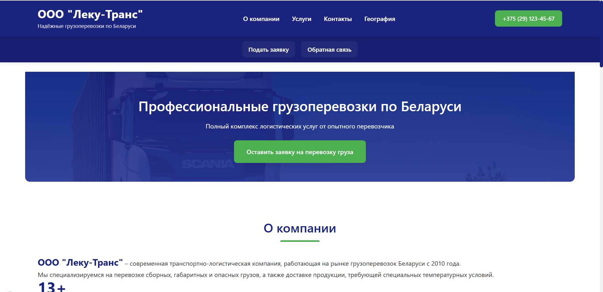

# Site-for-truckers

A business card website for a trucking company. This project was developed as part of a university web development course. It allows clients to submit cargo transportation requests and contact the company via a feedback form.

The Russian version is available [here](README.ru.md).

## Description
Many trucking companies lack a structured online presence, leading to chaotic communication via phone and messengers. This website solves the problem by providing a single information hub and a structured request submission tool. Clients can fill out a transportation request or send a message through the feedback form. Managers receive organized data, speeding up response times and reducing errors.

## Technologies Used
- **Frontend:** HTML5, CSS3, JavaScript (vanilla)
- **Backend:** PHP (native)
- **Databases:** MySQL (structured requests), MongoDB (feedback and comments)
- **Infrastructure:** Docker, Docker Compose
- **Security:** Environment variables (`.env`), input validation

## Features
- Online request form for cargo transportation (name, contact, cargo details, route).
- Feedback form for questions and comments.
- Company information and service descriptions on the main page.
- Fully responsive design (PC, tablet, mobile).
- Dual database architecture: MySQL for requests, MongoDB for flexible feedback messages.

## Screenshots

*Main page*  

 

*Request form*  

## Installation & Usage

### Requirements
- Windows / macOS / Linux with Docker and Docker Compose installed.
- Git.

### Steps
1. Clone the repository:

  `git clone https://github.com/your-username/Site-for-truckers.git`

  `cd Site-for-truckers`
   
2. Copy the environment configuration file:

  `cp .env.example .env`

  Edit .env with your database credentials and other settings.

3. Start the Docker containers:

  `docker-compose up -d`

4. Initialize the databases:

- Import the MySQL schema from database/mysql_schema.sql (if provided).

- MongoDB will be created automatically on first use.

5. Access the site at http://localhost:8080.

### How to Use
1. Browse the services and information on the main page.
2. Fill out the transportation request form (name, contact, cargo type, route).
3. Use the feedback form to send questions or comments.
4. Your requests and messages are sent directly to the company's database; managers will contact you.

### Limitations
- This is a study project, not intended for production use.
- No user accounts or request history tracking – all requests are handled manually by managers.
- The admin panel is minimal; full CRM integration is planned for future versions.

### Authors
Daria Dehterevich – [GitHub](https://github.com/ddeeduck), [Telegram](https://t.me/deeduck), [LinkedIn](www.linkedin.com/in/deeduck), Email: dehterevich.daria@gmail.com

Elizaveta Vishnyak – [GitHub](https://github.com/Ai393939), [Telegram](https://t.me/AiChan33), Email: lizavisnak@gmail.com

Project completed as part of the "Web Application Development 2025" course.

### License
This project is licensed under the MIT License – see the LICENSE file for details.
